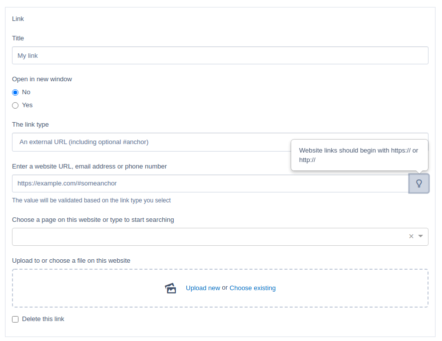

# Inline linking field for Silverstripe

This module provides a basic **inline** linking field, saving into the Link model provided by gorriecoe/silverstripe-link

This module is under development and should not be used on production websites.

Rather than take the content editor to a new data entry screen, the link can be added and saved to the current record in one of the provided fields:

- Enter an external URL
- Email address
- Internal page
- Existing file asset
- Phone

The object of this module is to:

- allow editing and creation of links within the context of the parent record
- have no Javascript dependencies, beyond those provided by core framework fields
- act as a drop-in replacement for the LinkField provided by gorriecoe/silverstripe-linkfield (for has-one relations only)
- publish Link `File` and `Sitetree` relations when the parent record is published, via the Silverstripe ownership API



## Usage

Use the `InlineLinkField` to load the fields:

```php
<?php
namespace Some\Thing;

use gorriecoe\Link\Models\Link;
use NSWDPC\InlineLinker\InlineLinkField;
use SilverStripe\ORM\DataObject;

//....

class MyThing extends DataObject {

    private static $has_one = [
        'MyLink' => Link::class
    ];

    public function getCmsFields()
    {
        $fields = parent::getCmsFields();
        $fields->removeByName('MyLinkID');// remove dropdownfield
        $fields->addFieldsToTab(
            'Root.Main', [
                //-- some fields
                $this->getLinkField()
                //-- some other fields
            ]
        );
        return $fields;
    }

    public function getLinkField() {
        return InlineLinkField::create(
                'MyLink',
                _t(__CLASS__ . '.LINK', 'My link title'),
                $this
        );
    }

}
```

## Requirements

See [composer.json](./composer.json)

## Installation

The recommended way of installing this module is via [composer](https://getcomposer.org/download/)

```shell
composer require nswdpc/silverstripe-inline-linker
```

> Remember to add a repository entry in composer.json to load this module, currently.

## License

[BSD-3-Clause](./LICENSE.md)

## Documentation

* [Documentation](./docs/en/001_index.md)

## Configuration

None, yet

You can find the extensions used in [./_config/config.yml](config.yml)

## Maintainers

+ [dpcdigital@NSWDPC:~$](https://dpc.nsw.gov.au)

## Bugtracker

We welcome bug reports, pull requests and feature requests on the Github Issue tracker for this project.

Please review the [code of conduct](./code-of-conduct.md) prior to opening a new issue.

## Security

If you have found a security issue with this module, please email digital[@]dpc.nsw.gov.au in the first instance, detailing your findings.

## Development and contribution

If you would like to make contributions to the module please ensure you raise a pull request and discuss with the module maintainers.

Please review the [code of conduct](./code-of-conduct.md) prior to completing a pull request.
