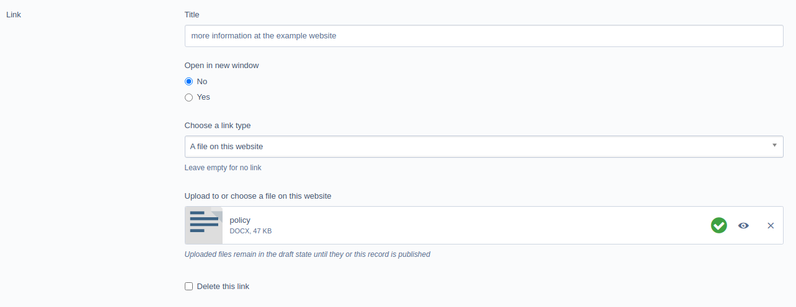

# Inline linking field for Silverstripe

This module provides:

+ a basic **inline** linking field,
+ saving into the existing Link model provided by [gorriecoe/silverstripe-link](https://github.com/gorriecoe/silverstripe-link)
+ delete link handling

This module is under active development, pull requests are welcome.

## Background

Rather than taking our content editors to a new data entry screen for the purposes of adding a link to a record, the field allows a link to be added to the current record within the context of that record.

The link can be added using one of the provided fields:

+ Enter an external URL
+ Enter an e-mail address
+ Select a page
+ Select a file asset
+ Enter a phone number

### Upload field example



The object of this module is to:

+ allow editing and creation of links within the context of the parent record
+ ~~have no Javascript dependencies, beyond those provided by core framework fields~~ (we tried)
+ act as a drop-in replacement for the LinkField provided by [gorriecoe/silverstripe-linkfield](https://github.com/gorriecoe/silverstripe-linkfield) (NB: **for has-one relations only**)
+ **automatically publish** linked `File` and/or `SiteTree` relations when the parent record is published, via the Silverstripe ownership API


### Elemental inline editing

This module supports inline editing in Elemental. The field will detect whether it has been loaded in an inline editable context and makes allowances for this.

Rather than create a React component for the field, we use the standard [MutationObserver API](https://developer.mozilla.org/en-US/docs/Web/API/MutationObserver) to detect field changes in the administration area based on an HTML5 data attribute attached to the relevant fields.

A source file is provided in [client/src/js/app.js](./client/src/js/app.js) for reference.

A future goal is to decouple the administration (entwine) event detection/handling and allow the field to be used outside the administration area.


## TODO

+ Fragment field for page linking

## Usage

* [Example](./docs/en/001_index.md#Example+usage)

## Requirements

See [composer.json](./composer.json)

## Installation

The only supported way of installing this module is via [composer](https://getcomposer.org/download/)

```shell
composer require nswdpc/silverstripe-inline-linker
```

## License

[BSD-3-Clause](./LICENSE.md)

## Documentation

* [Further documentation](./docs/en/001_index.md)

## Configuration

None, yet

You can find the extensions used in [config.yml](./_config/config.yml).

## Maintainers

+ [dpcdigital@NSWDPC:~$](https://dpc.nsw.gov.au)

## Bugtracker

We welcome bug reports, pull requests and feature requests on the Github Issue tracker for this project.

Please review the [code of conduct](./code-of-conduct.md) prior to opening a new issue.

## Security

If you have found a security issue with this module, please email digital[@]dpc.nsw.gov.au in the first instance, detailing your findings.

## Development and contribution

If you would like to make contributions to the module please ensure you raise a pull request and discuss with the module maintainers.

Please review the [code of conduct](./code-of-conduct.md) prior to completing a pull request.
